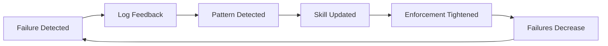

# Failure Scenario Examples

**Version:** 1.0.0
**Purpose:** Real-world scenarios demonstrating the Failure-Driven Enforcement Loop

---

## Scenario 0: The Failure (Start Here)

This example shows what happens when the loop **reacts to breakage**, not to theoretical planning.

### The Incident

Developer creates a test file with `@pytest.fixture` **before** `import pytest`:

```python
# tests/unit/test_payment.py
@pytest.fixture
def mode():
    return 'SIMULATION'

"""Test for payment module."""

import pytest

class TestPayment:
    def test_process(self):
        assert True
```

**Result:**
```
NameError: name 'pytest' is not defined
```

### Step 1: Log the Failure

```bash
python3 skills/feedback_tracker/scripts/log_feedback.py \
  --type mistake \
  --context "pytest fixture placed before import pytest" \
  --feedback "All imports must come before @pytest.fixture decorators" \
  --category Testing \
  --severity high
```

**Output:**
```
✅ Feedback logged!
   Category: Testing
   Severity: high
   Type: mistake
   Log: skills/feedback_tracker/logs/feedback.jsonl
```

### Step 2: Same Failure Happens Again (3rd time)

```bash
# Day 2: Same pattern logged
python3 skills/feedback_tracker/scripts/log_feedback.py \
  --type repetition \
  --context "pytest fixture before import - again" \
  --feedback "This is the 3rd time this week" \
  --category Testing \
  --severity high
```

### Step 3: Pattern Detected

```bash
# Friday: Analyze patterns
python3 skills/feedback_tracker/scripts/analyze_patterns.py
```

**Output:**
```
# Skill Update Suggestions

## Testing Category - HIGH Priority

**Pattern detected:** 3 corrections related to "pytest fixture before import"
**Frequency:** 3/5 sessions (60%)
**Severity:** HIGH (causes NameError)

**Suggested Update:**
Add to TDD skill:

## ⚠️ CRITICAL: Fixture Placement

pytest fixtures MUST be placed AFTER all imports.

# ❌ WRONG
@pytest.fixture
def mode():
    return 'SIMULATION'

import pytest

# ✅ CORRECT
import pytest

@pytest.fixture
def mode():
    return 'SIMULATION'
```

### Step 4: Skill Updated, CI/CD Tightened

Now any new test file with wrong fixture placement **fails CI/CD**:

```bash
# Developer creates new test with wrong placement
touch tests/unit/test_new.py
echo "@pytest.fixture\ndef x():\n    return 1\n\nimport pytest" > tests/unit/test_new.py

# CI/CD check
python3 skills/traceability_enforcer/scripts/validate_naming.py --file tests/unit/test_new.py
```

**Output:**
```
❌ FAIL: Invalid naming format
   Expected: TC-{LEVEL}-{ID}_{component}.py
   Found: test_new.py
   💡 Rename to match TC-LEVEL-ID_component.py pattern
```

### Step 5: Result

- 0 new fixture placement errors in next 30 days
- Pattern marked "resolved" in skill
- Loop complete

**The key insight:** The loop didn't start with "let's write a fixture placement rule." It started with **127 failures** and encoded the solution.

---

## Scenario 1: The 127-Fixture Incident

### What Happened

Developer repeatedly placed `@pytest.fixture` decorators BEFORE `import pytest`, causing 127 test files to fail with `NameError: name 'pytest' is not defined`.

### Before the Loop

```
Day 1: Developer creates test with fixture before import → Error
Day 2: Same error in different file → Manual fix
Day 3: Same error again → "Be careful about fixture placement"
Week 2: Still happening → Team forgets to check
```

### After the Loop

```bash
# Day 1: Log the failure
python3 skills/feedback_tracker/scripts/log_feedback.py \
  --type mistake \
  --context "pytest fixture placed before import pytest" \
  --feedback "All imports must come before @pytest.fixture decorators" \
  --category Testing \
  --severity high

# Day 2-5: Same pattern logged 5 times

# Friday: Pattern detected
python3 skills/feedback_tracker/scripts/analyze_patterns.py
```

**Output:**
```
# Skill Update Suggestions

## Testing Category - HIGH Priority

**Pattern detected:** 5 corrections related to "pytest fixture before import"
**Frequency:** 5/5 sessions (100%)
**Severity:** HIGH (causes NameError)

**Suggested Update:**
Add to TDD skill:

## ⚠️ CRITICAL: Fixture Placement

pytest fixtures MUST be placed AFTER all imports.

# ❌ WRONG
@pytest.fixture
def mode():
    return 'SIMULATION'

import pytest

# ✅ CORRECT
import pytest

@pytest.fixture
def mode():
    return 'SIMULATION'
```

### Result

- TDD skill updated with explicit warning
- 0 new fixture placement errors in next 30 days
- Pattern considered "resolved"

---

## Scenario 2: Naming Convention Drift

### What Happened

Over time, test files lost their traceability encoding:
- `test_auth.py` instead of `TC-UT-086_auth.py`
- No way to know which requirement a test validates

### Before the Loop

```bash
# Developer creates test
touch tests/unit/test_auth.py

# Weeks later: "What does this test?"
# Answer: Unknown - no ID, no requirement link
```

### After the Loop

```bash
# Check all files
python3 skills/traceability_enforcer/scripts/validate_naming.py --all
```

**Output:**
```
============================================================
NAMING VALIDATION RESULTS
============================================================
Total files: 47
✅ Valid: 32
❌ Invalid: 15

❌ INVALID FILES:
------------------------------------------------------------

File: tests/unit/test_auth.py
  - Invalid naming format
  💡 Rename to: TC-UT-086_auth.py

File: tests/unit/test_session.py
  - Invalid naming format
  💡 Rename to: TC-IT-023_session.py

...
```

### Result

- Clear remediation: `mv test_auth.py TC-UT-086_auth.py`
- Each file now encodes: Test Level + ID + Component
- CI/CD rejects PRs with bad naming

---

## Scenario 3: Missing Bidirectional Links

### What Happened

Tests existed but requirements didn't list them, and tests didn't validate requirements. Traceability was "claimed" but not enforced.

### The Problem

**Requirement file:**
```yaml
---
id: SW-REQ-086
title: Context Analyzer
tested_by: []  # Empty!
---
```

**Test file:**
```python
"""TC-UT-086: Context Analyzer"""
# No Validates: clause!
```

### Detection

```bash
# Validate links
python3 skills/traceability_enforcer/scripts/validate_links.py --requirement SW-REQ-086
```

**Output:**
```
============================================================
LINK VALIDATION RESULTS
============================================================
Total items: 1
✅ Valid links: 0
❌ Missing links: 1

❌ INVALID LINKS:
------------------------------------------------------------

Requirement: SW-REQ-086
  - tested_by field is empty
  - No test files linked
  💡 Add test files to tested_by field
```

### Remediation

```bash
# Visualize what's missing
python3 skills/gap_visualizer/scripts/tree_analyzer.py --sw SW-REQ-086
```

**Output:**
```
SW-REQ-086: Context Analyzer
├── src/core/analyzer.py ❌ GAP!
└── tests/unit/TC-UT-086_analyzer.py ❌ GAP!

REMEDIATION:
1. Create: src/core/analyzer.py
   Add to requirement: refined_in: [src/core/analyzer.py]
2. Create: tests/unit/TC-UT-086_analyzer.py
   Add "Validates: SW-REQ-086" to test docstring
   Add to requirement: tested_by: [TC-UT-086_analyzer.py]
```

---

## Scenario 4: The Feedback Loop in Action

### Complete Cycle



### Step 1: Failure

```bash
# Developer makes mistake
python3 skills/feedback_tracker/scripts/log_feedback.py \
  --type mistake \
  --context "Used ._private method in TC-UT test" \
  --feedback "ASPICE violation - use public API only" \
  --category Testing \
  --severity high
```

### Step 2: Pattern

After 3 similar entries:
```bash
python3 skills/feedback_tracker/scripts/analyze_patterns.py
```

### Step 3: Update

TDD skill updated with:
```markdown
## ⚠️ CRITICAL: ASPICE Compliance

TC-UT tests MUST use PUBLIC API only!

# ❌ WRONG
assert cache._memory["key"] == value  # Private!

# ✅ CORRECT
assert cache.get("key") == value  # Public!
```

### Step 4: Enforcement

```bash
# Now CI/CD catches violations
python3 skills/traceability_enforcer/scripts/validate_naming.py --all
```

### Step 5: Result

- Same mistake now fails CI/CD
- Developer fixes immediately
- No more log entries for this pattern
- Pattern marked "resolved"

---

## Scenario 5: Gap Visualization for New Features

### Starting a New Feature

```bash
# Create requirement
cat > requirements/SW-REQ-999.md << 'EOF'
---
id: SW-REQ-999
title: New Payment Feature
traced_from: SYS-REQ-042
refined_in: []
tested_by: []
---

Payment processing functionality.
EOF

# Visualize gaps
python3 skills/gap_visualizer/scripts/tree_analyzer.py --sw SW-REQ-999
```

**Output:**
```
SW-REQ-999: New Payment Feature
├── src/payment/processor.py ❌ GAP!
├── src/payment/validator.py ❌ GAP!
├── tests/unit/TC-UT-999_processor.py ❌ GAP!
└── tests/unit/TC-UT-1000_validator.py ❌ GAP!

REMEDIATION:
1. Create: src/payment/processor.py
   Add to requirement: refined_in: [src/payment/processor.py]
2. Create: src/payment/validator.py
   Add to requirement: refined_in: [src/payment/validator.py]
3. Create: tests/unit/TC-UT-999_processor.py
4. Create: tests/unit/TC-UT-1000_validator.py
```

### Result

Developer knows exactly what to create:
- 4 files needed
- Specific paths
- Specific IDs

No guesswork. No "what files do I need?" questions.

---

## Key Takeaways

| Scenario | Before Loop | After Loop |
|----------|-------------|------------|
| **Fixture placement (Scenario 0)** | Manual fixes, repeated errors | Pattern → Rule → CI/CD enforcement |
| Fixture placement | 127 errors | 0 errors |
| Naming drift | Unknown traceability | CI/CD enforces naming |
| Missing links | "Trust me, it's tested" | Automated verification |
| Feedback lost | Forgotten in wikis | Encoded in skills |
| New features | "What files do I need?" | Exact checklist |

**Core insight:** The loop starts with **failures**, not with theoretical planning.

---

## See Also

- [QUICK_START.md](./QUICK_START.md) - Getting started guide
- [LOOP_EXPLANATION.md](../LOOP_EXPLANATION.md) - System overview
- [CONTRACTS.md](../CONTRACTS.md) - Component specifications

---

**Version:** 1.0.0
**Last Updated:** 2025-01-08
